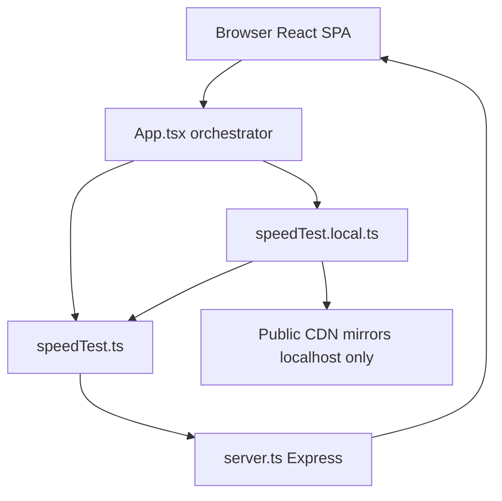

# Architecture

TarangStream is a **React SPA** plus a small **Express** server that provides download/upload endpoints and, in development, Vite middleware.

## High-level layout



## Repository map

```text
├── server.ts                 # Express API + Vite or static hosting
├── index.html                # Vite entry HTML
├── src/
│   ├── main.tsx              # React root
│   ├── App.tsx               # UI + test lifecycle orchestration
│   ├── types.ts              # Shared TypeScript types
│   ├── index.css             # Global styles (Tailwind)
│   ├── components/
│   │   ├── Gauge.tsx         # Download / upload dials
│   │   ├── StabilityChart.tsx
│   │   ├── StatsCard.tsx     # ISP / environment card
│   │   └── AboutPage.tsx
│   └── utils/
│       ├── speedTest.ts      # Production measurement engine
│       └── speedTest.local.ts# Localhost-only download/upload overrides
└── docs/                     # This documentation
```

## Layers

### 1. UI (`src/components/`, `App.tsx` shell)

- Dual **gauges** for live download/upload Mbps  
- Progress bar and phase label (latency → download → upload → complete)  
- ISP / geo card, server picker, history, diagnostics export  
- Dark/light theme  

### 2. Orchestrator (`App.tsx`)

- Owns `testPhase`, speeds, peaks, history, measurement mode  
- Sequences: resolve server → **latency** → **download** → **upload** → persist history  
- Supports cancel via `AbortController`  
- On real-path failure, falls back to **simulated** speed curves and sets measurement mode accordingly  

### 3. Measurement (`src/utils/`)

| Module | Role |
|--------|------|
| `speedTest.ts` | Ping/jitter, ISP lookup helpers, `runRealDownloadTest`, `runRealUploadTest`, smoothing helpers |
| `speedTest.local.ts` | Detects localhost; public CDN download URL; simulated local upload |

### 4. Server (`server.ts`)

| Route | Method | Purpose |
|-------|--------|---------|
| `/api/download` | GET | Continuous octet-stream for download testing |
| `/api/upload` | POST | Accept `application/octet-stream` bodies (size-capped) |
| `/api/health` | GET | Liveness JSON |

Cross-cutting server behavior (as implemented):

- Cache-control and basic security headers (`X-Content-Type-Options`, `X-Frame-Options`, `Referrer-Policy`)  
- Per-IP API rate limiting  
- Cap on concurrent download streams per IP  
- Download stream max duration (~30s)  
- Upload max payload ~2MB and content-type checks  

**Development:** Vite middleware serves the SPA.  
**Production (`NODE_ENV=production`):** static files from `dist/` + SPA fallback.

## Test sequence

1. **Server selection** — user choice or “optimal” nearest preset by distance from ISP coords  
2. **Latency** — multiple samples → average ping + jitter  
3. **Download** — parallel streams, sliding-window Mbps, EMA/WMA  
4. **Upload** — parallel uploads (or simulation on localhost / on failure)  
5. **Complete** — write history entry (localStorage), update UI  

## Measurement modes

| Mode | Meaning |
|------|---------|
| `live` | Real same-origin (or real network) measurement path |
| `local-mirror` | Localhost: CDN download + simulated upload (dev-friendly) |
| `simulated` | Fallback curves after real streams fail or are blocked |

UI badges surface non-live modes so results are not mistaken for pure live WAN tests.

## Client vs server responsibilities

| Concern | Client | Server |
|---------|--------|--------|
| UI / history / ISP display | Yes | No |
| Mbps math, multi-stream orchestration | Yes | Provides bytes only |
| Infinite/finite binary payload | Streams from API or CDN | Generates download chunks; discards upload bodies |
| Rate limits | N/A | Yes |

## Related docs

- [Measurement methodology](measurement-methodology.md)  
- [Setup](setup.md)  
- [Usage](usage.md)  
